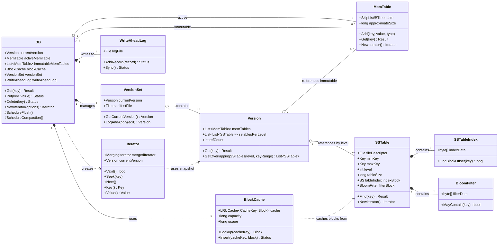

# Chapter 1 Overview

## Databases landscape

In this book, we are going to write a row-based key-value database using log-structure storage engine. The engine will be implemented using Sorted String Tables (SSTables) and Log-Structured Merge (LSM) tree on object storage like AWS S3.

## LSM Tree Database

Three main components of a database storage engine built on LSM Tree are
1. memtable
2. sorted-string table
3. WAL (write-ahead log) file

`memtable` is an in-memory data structure that serves reads and writes. New writes go to the wal for persistence. The WAL is regularly sends to object storage for durability.

The words memtable and SSTable started from [the Google Bigtable paper](https://research.google/pubs/bigtable-a-distributed-storage-system-for-structured-data/)

## The simplest storage engine

TODO
- implement the simple storage engine of book DDIA using append-only text file
- where are the weak spots
- how to address those weak spots by using SSTables and LSM tree storage engine

## References
- [Design Data Intensive Applications](https://www.amazon.com/Designing-Data-Intensive-Applications-Reliable-Maintainable/dp/1449373321)
- https://skyzh.github.io/mini-lsm

