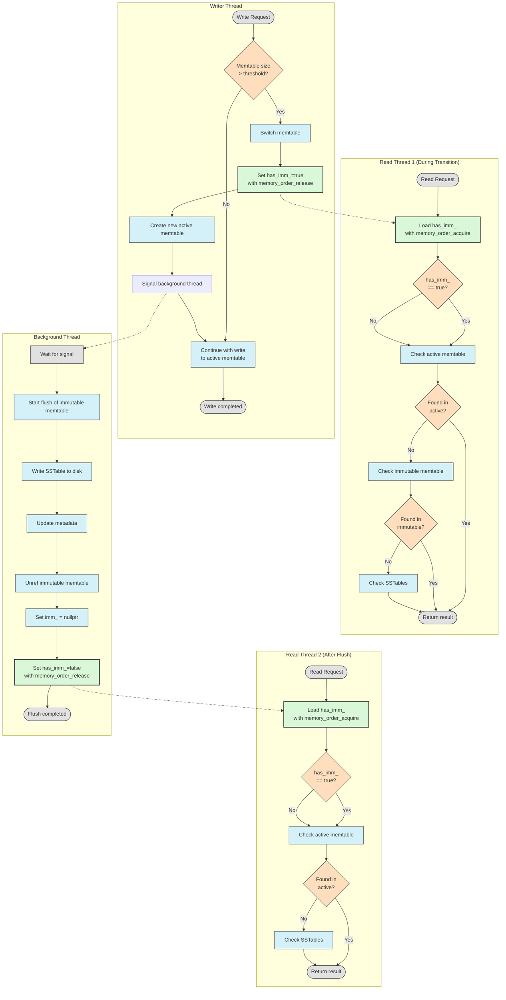
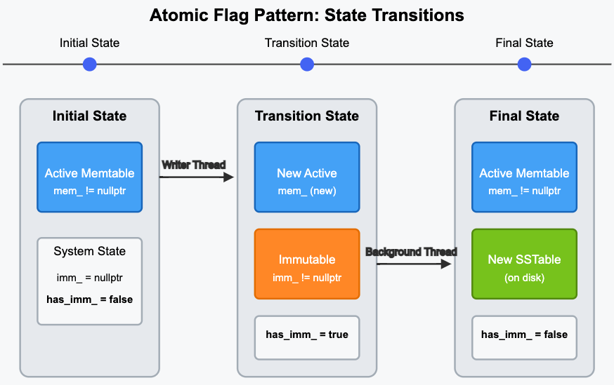
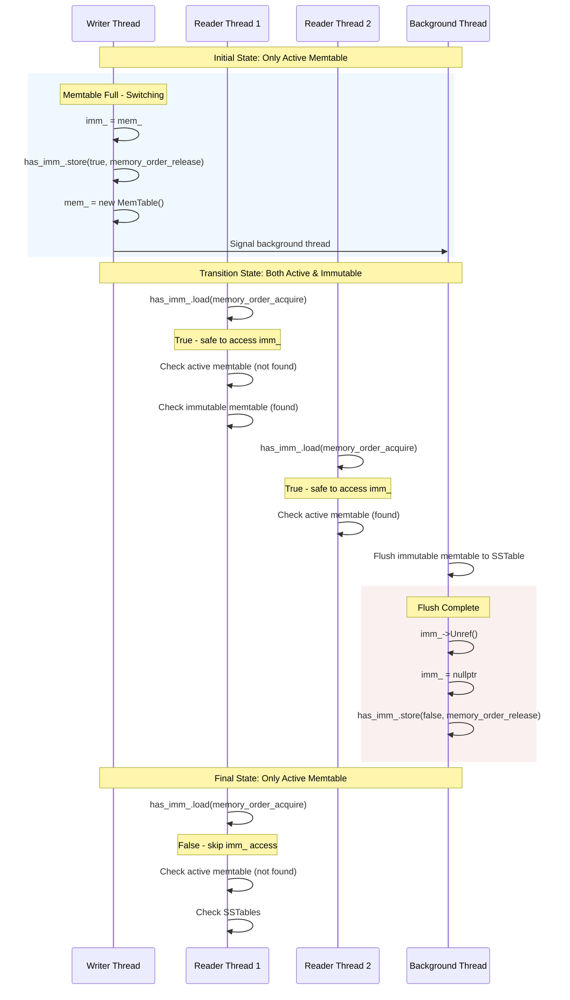

# Concurrency Memtable Freezing in LevelDB

How to handle concurrent reads and writes when memtable size threshold is exceeded?

## Threading Model




### concurrent write
1. size check
2. wait if already flushing
3. memtable switch

```cpp
// leveldb/db/db_impl.cc
Status DBImpl::MakeRoomForWrite(bool force) {

}
```

### concurrent reads

1. Atomic Flag for Immutable State `has_imm_.store(true, std::memory_order_release);`
2. Reference Counting for Safe Concurrent Access

### Atomic Flag has_imm_



States
1. **Initial State**
   1. only an active memtable exists.
   2. transition
      1. writer thread makes current memtable immutable.
      2. writer thread sets `has_imm_.store(true, memory_order_release)`
      3. writer thread creates a new active memtable.
      4. writer thread signals background thread.
2. **Transition State** 
   1. both active and immutable memtables exist. 
   2. read threads check both memtables active and immutable.
   3. transition
      1. background thread (BT) finishes flushing to SSTable.
      2. BT releases immutable memtable.
      3. Future readers will skip checking now non-existing immutable memtable.
3. Final State: immutable data now in SSTable, only memtable is active.

