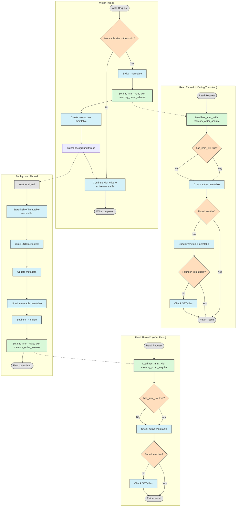
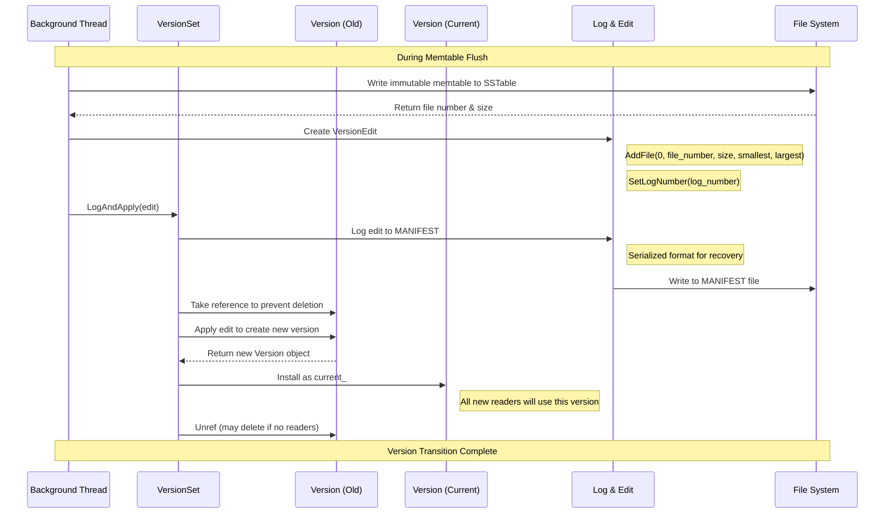
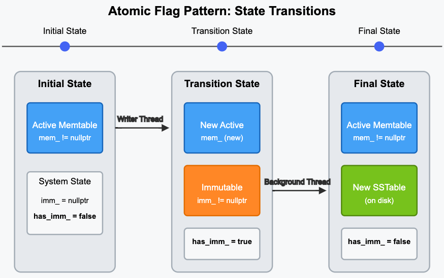
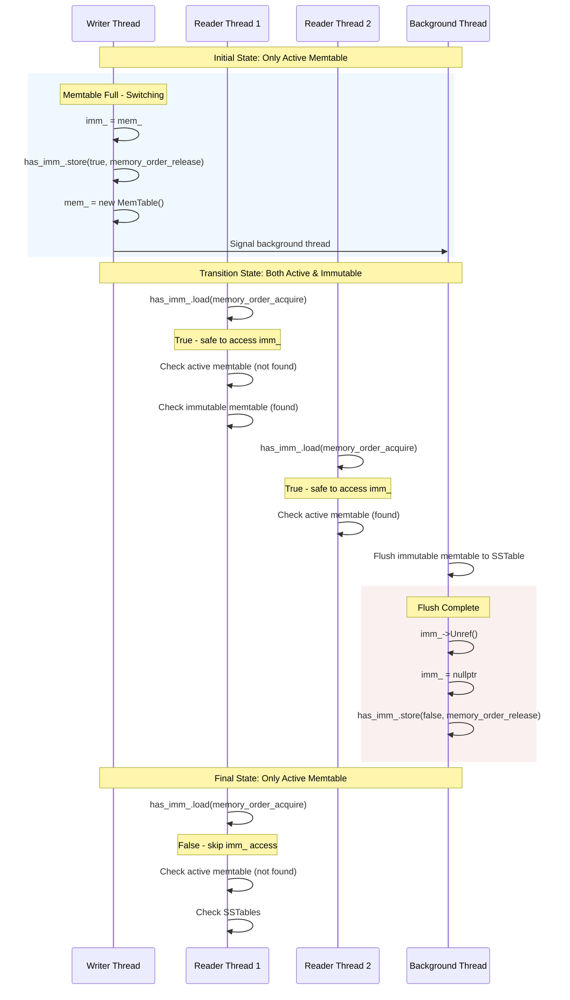

# Concurrency Memtable Freezing in LevelDB

- [Concurrency Memtable Freezing in LevelDB](#concurrency-memtable-freezing-in-leveldb)
  - [Threading Model](#threading-model)
  - [Writer Thread](#writer-thread)
  - [Background Thread](#background-thread)
    - [Background Memtable Flushing Details](#background-memtable-flushing-details)
  - [Reader Thread](#reader-thread)
    - [Atomic Flag has\_imm\_](#atomic-flag-has_imm_)

How to handle concurrent reads and writes when memtable size threshold is exceeded?
1. Old memtable is moved to immutable memtable list (imm).
2. A new memtable is installed atomically.
3. Background flushes are scheduled without blocking.

## Threading Model



## Writer Thread

1. size check
2. wait if already flushing
3. memtable switch

```cpp

```

**Memtable Switch**
1. new WAL log file created
2. current memtable moved to `imm_` immutable memtable
3. `has_imm_` flag is atomically set using memory order release semantics
4. new empty memtable is created
5. background compaction is scheduled

```cpp
// leveldb/db/db_impl.cc
Status DBImpl::MakeRoomForWrite(bool force) {
    // step 1 create new WAL log file
    assert(versions_->PrevLogNumber() == 0);
    uint64_t new_log_number = versions_->NewFileNumber();
    WritableFile* lfile = nullptr;
    s = env_->NewWritableFile(LogFileName(dbname_, new_log_number), &lfile);
    // ... [create new log file]
    delete log_;
    delete logfile_;
    logfile_ = lfile;
    logfilenumber_ = new_log_number;
    log_ = new log::Writer(lfile);

    // step 2
    imm_ = mem_;
    // step 3
    has_imm_.store(true, std::memory_order_release);

    // step4: create new empty memtable
    mem_ = new Memtable(internal_comparator_);
    mem_->Ref();

    // step5: signal for background thread to flush immutable memtable to SSTable
    MaybeScheduleCompaction();
    // ...
}

// signal the background thread to do work async
void DBImpl::MaybeScheduleCompaction() {
    mutex_.AssertHeld();
    if (!background_compaction_scheduled_ && !shutting_down_.load() && 
      bg_error_.ok() && (imm_ != nullptr || versions_->NeedsCompaction())) {
        background_compaction_scheduled_ = true;
        env_->Schedule(&DBImpl:BGWork, this); // schedule work for background thread
    }
```

FAQ
- why we need to create new log file in writer thread?
  - **simplify design and storage management**: 
    - it makes the design simple as one log file matches to one memtable.
    - preventing any log file from growing too large.
    - we can just delete the log file of the flushed memtable (to SSTable) without any impact.
    - without separate log file, it's hard to know which part of log file to be deleted.
  - **simplify recovery:**
    - each log file matches to a memtable that might not have been flushed.
    - system can easily find out which log file to be replayed for current memtable.

## Background Thread

Writer thread signals the background thread to flush memtable to SSTable asynchronously.
Background thread executes `CompactMemTable` method.

Background thread actions
1. wake up and acquire mutex
2. do compaction work of flushing immutable memtable to SSTable
   1. flush immutable memtable to disk
   2. update version metadata
   3. clear immutable memtable pointer
   4. clear atomic flag
3. signal completion to any waiting threads after finished

Shared data structures with other reader, writer threads
1. immutable memtable pointer `imm_`
2. version metadata for the database

### Background Memtable Flushing Details
1. write immutable memtable to disk as a Level-0 SSTable
2. update version metadata to include new SSTable

```cpp
Status DBImpl::CompactMemTable() {
    mutex_.AssertHeld();
    assert(imm_ != nullptr);

    // save memtable as L0 SSTable

    VersionEdit edit;
    edit.SetLogNumber(logfile_number_);
    edit.AddFile()
    
}
```

Questions
- what is version metadata? 
- why do we need version metadata?
  - consistency: readers operate on specific versions while the database changes (writes, compaction).
- why do we change it here background flushing?

Edit version metadata in background thread compaction


## Reader Thread

1. Atomic Flag for Immutable State `has_imm_.store(true, std::memory_order_release);`
2. Reference Counting for Safe Concurrent Access

### Atomic Flag has_imm_



States
1. **Initial State**
   1. only an active memtable exists.
   2. transition
      1. writer thread makes current memtable immutable.
      2. writer thread sets `has_imm_.store(true, memory_order_release)`
      3. writer thread creates a new active memtable.
      4. writer thread signals background thread.
2. **Transition State** 
   1. both active and immutable memtables exist. 
   2. read threads check both memtables active and immutable.
   3. transition
      1. background thread (BT) finishes flushing to SSTable.
      2. BT releases immutable memtable.
      3. Future readers will skip checking now non-existing immutable memtable.
3. **Final State**
   1. immutable data now in SSTable, only memtable is active.


