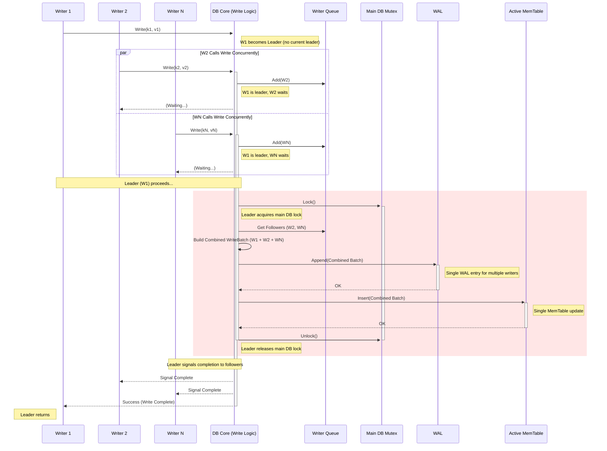

# LevelDB synchronization strategies

Table of Contents
<!-- vscode-markdown-toc -->
* 1. [The Main Mutex DBImpl::mutex_](#TheMainMutexDBImpl::mutex_)
* 2. [Write Batch Grouping (DBImpl::Write)](#WriteBatchGroupingDBImpl::Write)
* 3. [Immutability (MemTables, SSTables, Versions)](#ImmutabilityMemTablesSSTablesVersions)
* 4. [Reference Counting (Version)](#ReferenceCountingVersion)
* 5. [Background Thread Coordination (Condition Variable - DBImpl::bg_cv_)](#BackgroundThreadCoordinationConditionVariable-DBImpl::bg_cv_)
* 6. [Single Background Worker Thread (DBImpl::BGWork)](#SingleBackgroundWorkerThreadDBImpl::BGWork)
* 7. [Block Cache Synchronization](#BlockCacheSynchronization)
	* 7.1. [Lock definition](#Lockdefinition)
	* 7.2. [Lookup(key, hash)](#Lookupkeyhash)

<!-- vscode-markdown-toc-config
	numbering=true
	autoSave=true
	/vscode-markdown-toc-config -->
<!-- /vscode-markdown-toc -->


LevelDB's main synchronization strategies
1. A coarse-grained mutex `DBImpl::mutex_` protecting critical, short-duration metadata operations and MemTable switching.
2. Write batch grouping to optimize concurrent writes under the main mutex.
3. Extensive use of immutability for MemTables, SSTables, and Versions, allowing reads to proceed largely without contending for the main mutex.
4. Reference counting on Version objects to safely manage the lifecycle of SSTables independently of active readers.
5. A single background thread (coordinated via a condition variable) performing long-running I/O (flushes/compactions), simplifying background task synchronization.
6. Specific locking within subsystems like the Block Cache.

##  1. <a name='TheMainMutexDBImpl::mutex_'></a>The Main Mutex DBImpl::mutex_

**Mechanism:** A single, coarse-grained `pthread_mutex_t`.

**Scope:** This is the central lock protecting the core mutable state of the database instance (DBImpl). It is held for short durations during critical operations.

**Protects:**
1. MemTable Switching: Atomically switching the active_mem_ pointer to a new MemTable and moving the old one to the imm_ (immutable) list.
2. VersionSet Updates: Installing a new Version (which represents the current set of live SSTables and immutable MemTables) after a MemTable flush or compaction completes. This involves updating the current_ version pointer and potentially writing to the MANIFEST file.
3. Accessing Immutable MemTable List: Adding to or reading the list of immutable MemTables (imm_) that are waiting to be flushed.
4. Scheduling Background Work: Checking if background work (flush/compaction) is needed and signaling the background thread if necessary. Managing compaction pointers and state.
5. Write Batch Management: Coordinating the grouping of writes from multiple threads (see point 2).
6. Shared Counters/State: Accessing internal counters or flags within DBImpl.
7. DB Shutdown/Cleanup: Ensuring state is consistent during shutdown.

**NOT Protect:**
- Long-running I/O operations like 
  - reading/writing SSTable blocks, 
  - writing to the WAL (mostly, see batching), 
  - the actual computation within a compaction/flush. 
- Holding the mutex during I/O would severely limit concurrency.

##  2. <a name='WriteBatchGroupingDBImpl::Write'></a>Write Batch Grouping (DBImpl::Write)

**Mechanism:** When multiple threads call Put or Delete, LevelDB doesn't necessarily acquire the main mutex for each one individually. Instead, it uses a queue (writers_) and a leader-follower model.

**Synchronization:**
1. Writers add themselves to the queue.
2. One writer becomes the "leader".
3. The leader acquires the DBImpl::mutex_.
4. It builds a single WriteBatch containing its own writes and the writes of all waiting followers.
5. It performs the atomic operations for the entire batch under the mutex: appending the batch to the WAL and inserting the batch's changes into the current Active MemTable.
6. It releases the DBImpl::mutex_.
7. It signals the followers that their writes are complete (or persisted if sync was requested).

**Benefit:** Amortizes the cost of acquiring the main mutex and writing to the WAL across multiple writers, significantly improving concurrent write throughput.

The critical section is shown in Pink is where the mutex held.



##  3. <a name='ImmutabilityMemTablesSSTablesVersions'></a>Immutability (MemTables, SSTables, Versions)

Mechanism: 
- This is a design principle, not a lock mechanism. 
- Once a MemTable is full, it becomes immutable. 
- SSTables are always immutable once created. 
- Version objects representing the database state are also immutable.

Synchronization Benefit: 
- Readers can access immutable structures without acquiring the main mutex. 
- Once a reader obtains a pointer (e.g., to an immutable MemTable or a Version), it knows that structure's content will not change underneath it. 
- This allows reads to proceed largely lock-free relative to the main mutex.

##  4. <a name='ReferenceCountingVersion'></a>Reference Counting (Version)

**Mechanism:**
- Version objects have reference counts. 
- When a read operation starts, it acquires a reference to the current_ Version. 
- Iterators also hold a reference to the Version they were created on. 
- Background operations (compactions/flushes) hold references while working.

**Synchronization Benefit:**
- Prevents the underlying SSTables associated with a Version from being deleted by background compaction while readers are still using that Version. 
- A Version (and its associated files) is only truly cleaned up when its reference count drops to zero. 
- This decouples readers from the lifecycle management performed by background threads.

##  5. <a name='BackgroundThreadCoordinationConditionVariable-DBImpl::bg_cv_'></a>Background Thread Coordination (Condition Variable - DBImpl::bg_cv_)

Mechanism: A pthread_cond_t used in conjunction with the DBImpl::mutex_.

Synchronization:
1. Signaling Work: When the main thread determines a flush or compaction is needed (while holding mutex_), it signals (pthread_cond_signal) the condition variable to wake up the single background thread (bg_work_).
2. Waiting for Work: The background thread waits (pthread_cond_wait) on this condition variable when idle, releasing mutex_ while waiting and re-acquiring it upon wakeup.
3. Write Stalls: If writes need to be stalled (e.g., too many L0 files), writers might wait on a condition variable until a background compaction makes progress.

##  6. <a name='SingleBackgroundWorkerThreadDBImpl::BGWork'></a>Single Background Worker Thread (DBImpl::BGWork)

Mechanism: LevelDB uses only one background thread for both MemTable flushes and SSTable compactions.

Synchronization Benefit
- This simplifies coordination between background tasks. 
- Since only one background task runs at a time, there's no need for complex locking to prevent concurrent flushes/compactions from interfering with each other when modifying the VersionSet or file structure. 
- They still need to acquire the main mutex_ briefly to install their results (the new Version). 
- Note: Forks like RocksDB allow multiple background threads, requiring more fine-grained locking.

##  7. <a name='BlockCacheSynchronization'></a>Block Cache Synchronization

Mechanism: The BlockCache implementation (typically an LRU cache) needs its own internal locking (often a separate mutex or more fine-grained locking/sharding) to protect its internal data structures (hash table, linked list) from concurrent access by multiple readers and the background thread fetching blocks during compactions. This lock is separate from DBImpl::mutex_.

**Strategy**: Coarse-grained locking. The entire internal state of the cache (hash table, LRU lists, usage counters) is protected by this single mutex.


###  7.1. <a name='Lockdefinition'></a>Lock definition

```cpp
// From the general structure within cache.cc related to LRUCache
class LRUCache {
 // ... other members ...
 private:
  // Handles linking cache entries
  LRUHandle list_; // Head of LRU list (doubly linked list)
  LRUHandle in_use_; // Head of in-use list (entries returned by Lookup)

  // Hash table for fast lookups
  HandleTable table_;

  // The mutex protecting all internal data structures of the cache.
  port::Mutex mutex_; // <--- THE PRIMARY LOCK

  // Current total charge of cache entries
  size_t usage_;

  // Capacity of the cache
  size_t capacity_;

  // ... other helper methods like LRU_Append, LRU_Remove, Ref, Unref ...
};
```

###  7.2. <a name='Lookupkeyhash'></a>Lookup(key, hash)

```cpp
// Simplified from LRUCache::Lookup in cache.cc
Cache::Handle* LRUCache::Lookup(const Slice& key, uint32_t hash) {
  MutexLock l(&mutex_); // <--- Acquire lock at the beginning of the scope
  LRUHandle* e = table_.Lookup(key, hash);
  if (e != nullptr) {
    // Entry found, increment reference count
    Ref(e);
    // Move to the front of the in_use_ list if it was in the regular LRU list
    // (Code for LRU_Remove(e); LRU_Append(&in_use_, e);)
  }
  // Lock is automatically released here by MutexLock destructor '~l'
  return reinterpret_cast<Cache::Handle*>(e);
}
```